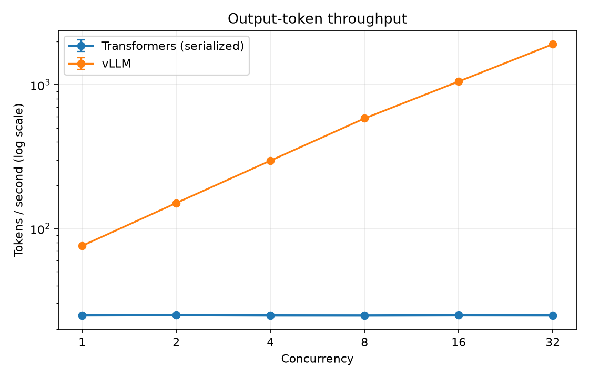
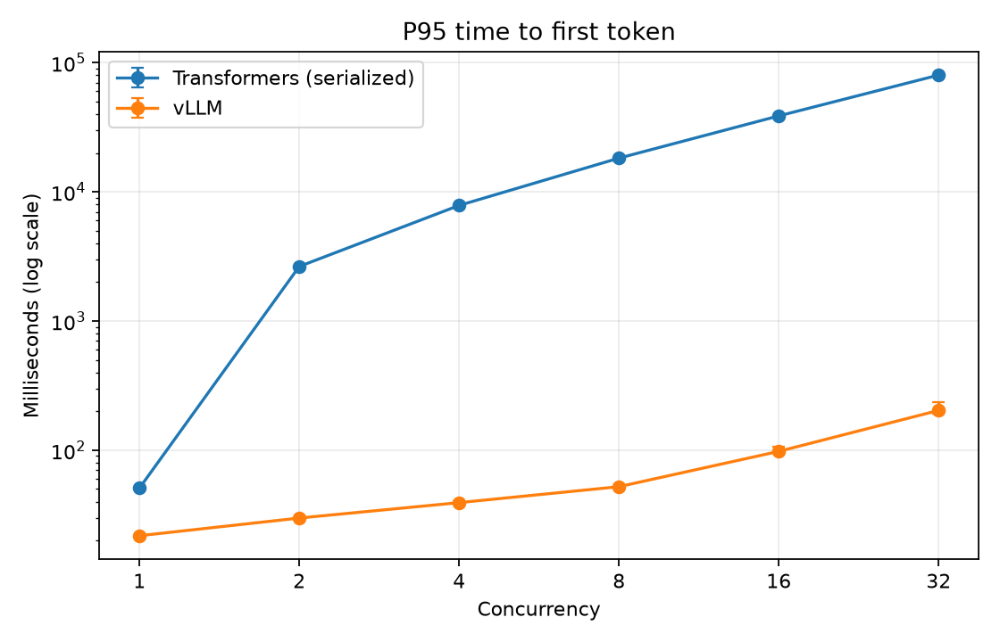

# Qwen3-8B backend comparison on one A100

This report records a controlled short-chat comparison between the serialized Hugging Face
Transformers reference backend and vLLM continuous serving on the same rented GPU. All numbers
below come from the committed summaries and raw request records; validation smoke timings are
excluded.

## Result

vLLM delivered higher output-token throughput and lower P95 latency at every tested concurrency.
Its throughput continued to rise through concurrency 32, so this experiment did not locate vLLM's
saturation point. The serialized baseline stayed near 25 output tokens/s while queueing latency
grew with concurrency.

| Concurrency | Transformers tok/s | vLLM tok/s | Throughput ratio | Transformers P95 TTFT | vLLM P95 TTFT | Transformers P95 E2E | vLLM P95 E2E |
|---:|---:|---:|---:|---:|---:|---:|---:|
| 1 | 24.894 | 75.776 | 3.04x | 50.8 ms | 21.8 ms | 2,611.3 ms | 845.3 ms |
| 2 | 24.976 | 150.416 | 6.02x | 2,642.8 ms | 29.8 ms | 5,179.2 ms | 851.3 ms |
| 4 | 24.861 | 296.538 | 11.93x | 7,845.6 ms | 39.2 ms | 10,388.5 ms | 865.1 ms |
| 8 | 24.836 | 583.702 | 23.50x | 18,228.6 ms | 52.2 ms | 20,770.4 ms | 886.8 ms |
| 16 | 24.916 | 1,054.541 | 42.32x | 38,701.1 ms | 97.8 ms | 41,221.9 ms | 953.3 ms |
| 32 | 24.872 | 1,914.192 | 76.96x | 80,123.8 ms | 203.1 ms | 82,646.1 ms | 1,094.4 ms |

Each value is the median of three repeated trial summaries. Plot error bars show the minimum and
maximum trial values. A logarithmic axis is used when the cross-series range is at least 20x.





Additional plots: [request throughput](plots/request_throughput_rps.png) and
[P95 end-to-end latency](plots/latency_ms_p95.png).

## What the hypotheses say

1. The concurrency-one baseline hypothesis was not supported for this model and software stack:
   vLLM was 3.04x higher in output-token throughput and had lower P95 TTFT and end-to-end latency.
2. The vLLM concurrency hypothesis was supported over the tested range: output throughput rose
   from 75.776 tokens/s at concurrency 1 to 1,914.192 tokens/s at concurrency 32.
3. The latency tradeoff appeared within vLLM: P95 TTFT rose from 21.8 ms to 203.1 ms as concurrency
   increased. Throughput had not plateaued by concurrency 32, so saturation remains unmeasured.

These observations apply to this controlled configuration. The high-concurrency ratio primarily
compares vLLM continuous batching with the project's deliberately serialized reference adapter;
it is not a claim about every possible Transformers serving implementation.

## Controlled setup

- Date: 2026-08-01 UTC (the vLLM run finished shortly after midnight UTC on August 2)
- Provider: Lambda Cloud at the recorded rate of $1.99/hour
- GPU: 1x NVIDIA A100-SXM4-40GB, driver 580.105.08
- CPU/RAM: AMD EPYC 7J13, 216 GiB observed RAM
- Model: `Qwen/Qwen3-8B`
- Model revision: `b968826d9c46dd6066d109eabc6255188de91218`
- Dtype: BF16
- Workload: 10 short-chat-style raw prompts, 132–158 input tokens (mean 145.3)
- Dataset SHA-256: `520495730dea75d35688682f0fe31ded568b5789a3397187df3bf333caa5f0e0`
- Generation: maximum 64 output tokens, temperature 0, top-p 1, seed 42
- Load: concurrency 1, 2, 4, 8, 16, 32; 120 measured requests per level
- Repetition/warm-up: 3 repetitions and 10 excluded warm-ups before every trial
- Benchmark Git commit: `4983d06d8076b201dd74b2a85df4009ddd790eff`, clean worktree

The Transformers environment used Python 3.11.15, Torch 2.13.0+cu130, Transformers 5.14.1,
and Accelerate 1.14.0. Its complete freeze is in `transformers.environment.txt`. vLLM used the
exact image `vllm/vllm-openai@sha256:ffb2d59b1c059a5bd8d781320c9f5189de8293693b7d95da54befddaa54abf52`
(vLLM 0.26.0, Torch 2.11.0+cu130). Prefix caching was disabled. The gateway build had image ID
`sha256:a5e3e9f8bdcb3d099399bb1ce10265a974675132d6dbc996bd89f91a9ae7488e`;
its complete dependency freeze is in `vllm-gateway.environment.txt`.

The benchmark commands are recorded verbatim in each summary manifest. The common measured shape
was:

```bash
python -m inference_lab.benchmark.runner \
  --url http://127.0.0.1:8000 \
  --dataset data/short_chat.jsonl \
  --concurrency 1,2,4,8,16,32 \
  --requests 120 \
  --repetitions 3 \
  --warmup-requests 10 \
  --max-new-tokens 64 \
  --temperature 0 \
  --top-p 1 \
  --seed 42 \
  --metadata results/<backend>-qwen3-8b-metadata.json \
  --output results/<backend>-qwen3-8b-short-chat.jsonl
```

## Integrity audit

- 2,160 measured rows, 18 trials, and 6 aggregate concurrency rows per backend
- 4,320/4,320 requests successful; every request reported exactly 64 output tokens
- prompt indices and hashes match the committed dataset; request indices are complete per trial
- manifests agree on model, revision, dtype, dataset digest, request controls, load, and hardware
- every trial percentile/count summary and every aggregate median was recomputed from raw rows
- the Transformers dependency freeze SHA-256 matches its embedded metadata
- raw and summary file hashes are recorded in `SHA256SUMS`

The transferred archive SHA-256 was
`1211195d41f1717f0192e86a39d66fd13c98c0990252aaa3d28f1443ac523738`.
The audit found a maximum 0.0002 tokens/s recomputation delta because benchmark commit `4983d06`
rounded stored trial wall time more aggressively than throughput. No result was edited. Commit
`c8da85a` preserves the full denominator for future artifacts; the original bytes and hashes here
remain unchanged.

Verify the committed files from this directory with:

```bash
shasum -a 256 -c SHA256SUMS
```

## Cost and limitations

The client-observed run windows, including warm-ups, were 6,019.177 seconds for Transformers and
665.472 seconds for vLLM. At the recorded hourly rate, those windows correspond to approximately
$3.33 and $0.37. This is not the total rental bill: setup, downloads, smoke tests, and idle time are
excluded.

This experiment covers one GPU, one model, one short-prompt workload, deterministic decoding, and
one implementation of each backend. It did not collect GPU utilization, peak memory, cache-hit
metrics, or output-quality scores. Output text is not stored, so the results support performance
claims only. No result here establishes behavior for long-prefill, decode-heavy, prefix-reuse,
quantized, multi-GPU, or production multi-tenant workloads.
