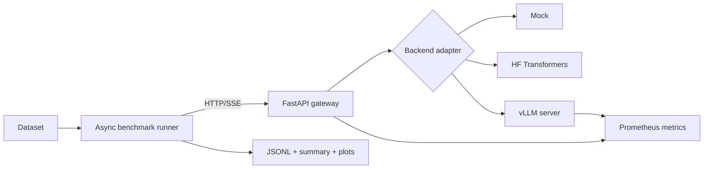

# Inference Lab

A portfolio-ready MVP for comparing LLM inference backends under reproducible concurrent load.

The project is intentionally focused on **ML systems evidence**, not another chatbot UI. It gives you a stable streaming API, pluggable backends, Prometheus instrumentation, an async load generator, raw experiment artifacts, and a roadmap toward quantization, prefix caching, speculative decoding, Triton, and multi-GPU serving.

## What the MVP demonstrates

- backend-neutral inference service design
- streaming generation and time-to-first-token measurement
- concurrent load generation with controlled workloads
- P50/P95 latency and throughput analysis
- observability with Prometheus
- Dockerized vLLM deployment
- deterministic, GPU-free CI
- clean extension points for deeper inference work

## Architecture



See [`docs/ARCHITECTURE.md`](docs/ARCHITECTURE.md) for component and design details.

## Tech stack

| Layer | Choice | Why |
|---|---|---|
| API | Python 3.11, FastAPI, Pydantic | Typed async API with automatic OpenAPI docs |
| Streaming | Server-sent events | Simple client-observable TTFT measurement |
| Baseline runtime | Hugging Face Transformers + PyTorch | Transparent reference implementation |
| Optimized runtime | vLLM OpenAI-compatible server | Production-oriented continuous serving runtime |
| Load generation | asyncio + HTTPX | Controlled concurrency without another service |
| Metrics | Prometheus client + Prometheus | Histograms, counters, in-flight load, token counts |
| Artifacts | JSONL and JSON | Easy to inspect, version, and analyze |
| Packaging | `pyproject.toml`, Docker Compose | Reproducible local and GPU setup |
| Quality | pytest, Ruff, GitHub Actions | GPU-free validation through the mock backend |

## Repository layout

```text
src/inference_lab/
  app.py                       FastAPI gateway and SSE contract
  backends/
    base.py                    Backend interface
    mock.py                    Deterministic CI backend
    transformers_local.py      Simple local PyTorch baseline
    openai_compatible.py       vLLM adapter
  benchmark/
    runner.py                  Concurrent benchmark CLI
    stats.py                   Percentiles and throughput summaries
scripts/plot_results.py        Result plotting
data/prompts.jsonl             Starter workload
docs/                          Architecture and experiment plan
tests/                         API and statistics tests
```

## Start in mock mode

The mock backend validates the full service and benchmark path without downloading a model.

```bash
python -m venv .venv
source .venv/bin/activate
pip install -e ".[dev]"
uvicorn inference_lab.app:app --reload
```

In another terminal:

```bash
python -m inference_lab.benchmark.runner \
  --url http://localhost:8000 \
  --dataset data/prompts.jsonl \
  --concurrency 1,4,8 \
  --requests 24 \
  --repetitions 1 \
  --warmup-requests 2 \
  --max-new-tokens 32 \
  --output results/mock.jsonl
```

This is a smoke test, not a publishable performance run. The reduced repetition and warm-up
counts keep local validation quick.

Outputs:

- `results/mock.jsonl`: one row per measured request; warm-ups are excluded
- `results/mock.summary.json`: experiment manifest, per-repetition summaries, and median metrics
  per concurrency level

API documentation is available at `http://localhost:8000/docs`; Prometheus metrics are at `http://localhost:8000/metrics/`.

## Run the Hugging Face baseline

Install the optional PyTorch/Transformers dependencies:

```bash
pip install -e ".[dev,hf]"
cp .env.example .env
```

Set:

```dotenv
INFERENCE_LAB_BACKEND=transformers
INFERENCE_LAB_MODEL=Qwen/Qwen3-0.6B
INFERENCE_LAB_MODEL_REVISION=<full-hugging-face-commit-sha>
INFERENCE_LAB_MODEL_DTYPE=bfloat16
INFERENCE_LAB_TRANSFORMERS_DEVICE=auto
```

Then start the gateway and run the same benchmark command. The baseline deliberately serializes
generation, so concurrent requests queue and that queueing time appears in client/server TTFT. This
keeps seeded sampling deterministic and gives optimized serving behavior a clear comparison point.

## Run vLLM on an NVIDIA GPU

Prerequisites:

- Docker and Docker Compose
- NVIDIA driver
- NVIDIA Container Toolkit
- enough GPU memory for the selected model

```bash
cp .env.example .env
INFERENCE_LAB_BACKEND=openai docker compose --profile gpu up --build
```

The gateway is exposed on port `8000`, vLLM on port `8001`, and Prometheus on port `9090`.
This base Compose file leaves prefix caching disabled so it can serve as the vLLM default
configuration in the first experiment.

For a measured comparison, set `INFERENCE_LAB_MODEL_REVISION` to a full Hugging Face commit SHA
and `INFERENCE_LAB_MODEL_DTYPE` to the same explicit dtype for both backends. Compose passes both
values to vLLM, while the Transformers adapter passes the revision to the tokenizer and model.
The gateway health response and benchmark manifest report the configured values. The defaults
`main` and `auto` are convenient for smoke testing but are not publishable controls.

For the separate repeated-prefix condition, use the explicit override:

```bash
INFERENCE_LAB_BACKEND=openai docker compose \
  -f docker-compose.yml \
  -f docker-compose.prefix-cache.yml \
  --profile gpu up --build
```

Run the benchmark:

```bash
python -m inference_lab.benchmark.runner \
  --url http://localhost:8000 \
  --dataset data/prompts.jsonl \
  --concurrency 1,2,4,8,16,32 \
  --requests 120 \
  --repetitions 3 \
  --warmup-requests 10 \
  --max-new-tokens 64 \
  --metadata experiment-metadata.json \
  --output results/vllm.jsonl
```

For published results, replace floating `latest` image tags with an exact image tag or digest and record the GPU, driver, model revision, and command.

## Reproducible artifacts

The runner checks `/health` before load starts and records the resolved backend and model. Every
summary also includes:

- a unique experiment ID and UTC start/finish times
- the canonical benchmark command, original process arguments, and all resolved settings
- Git commit and dirty state
- dataset path, SHA-256 digest, and prompt count
- client platform, Python version, and relevant package versions
- optional user-supplied server metadata

Use `--metadata` for facts the benchmark client cannot discover from the gateway. Keep secrets out
of this file. A publishable metadata file should look like this, with every placeholder replaced by
an observed value:

```json
{
  "hardware": {
    "gpu_model": "<exact GPU model>",
    "gpu_count": 1,
    "cpu_model": "<exact CPU model>",
    "ram_gib": "<observed RAM>"
  },
  "software": {
    "gpu_driver": "<driver version>",
    "cuda": "<CUDA version>",
    "container_image": "vllm/vllm-openai@sha256:<digest>",
    "model_revision": "<Hugging Face commit SHA>"
  },
  "runtime": {
    "flags": ["--gpu-memory-utilization", "0.90"]
  },
  "environment": {
    "INFERENCE_LAB_BACKEND": "openai",
    "INFERENCE_LAB_MODEL": "<model ID>"
  }
}
```

Defaults follow the experiment plan: 10 warm-up requests before each concurrency/repetition pair,
three measured repetitions, and median aggregate metrics. Warm-ups never appear in raw results.
`runs` in the summary contains the medians used by the plotting script; `trials` retains every
per-repetition summary. Raw rows contain stable prompt indices and hashes so prompt order can be
audited against the dataset digest.

If an upstream backend omits exact token usage, token counts and output-token throughput remain
`null`; the lab does not estimate them from whitespace. An HTTP 200 stream is counted as successful
only after a terminal `done` event.

## Plot a summary

```bash
pip install -e ".[plots]"
python scripts/plot_results.py results/vllm.summary.json
```

The script creates separate throughput, TTFT, and latency figures under `results/plots/`.

## API examples

Non-streaming:

```bash
curl -s http://localhost:8000/v1/generate \
  -H 'content-type: application/json' \
  -d '{
    "prompt": "Explain KV caching in two paragraphs.",
    "max_new_tokens": 64,
    "temperature": 0
  }'
```

Streaming:

```bash
curl -N http://localhost:8000/v1/generate/stream \
  -H 'content-type: application/json' \
  -d '{
    "prompt": "Explain continuous batching.",
    "max_new_tokens": 64,
    "temperature": 0
  }'
```

## Fair benchmark checklist

- use the same model revision and tokenizer
- keep prompt order and generation parameters fixed
- warm up each runtime before collecting results
- separate short-prefill, long-prefill, decode-heavy, and repeated-prefix workloads
- run each configuration multiple times
- retain raw request results
- report failures and outliers
- record hardware, image digest, Git commit, and runtime flags

The runner records client-visible facts automatically. Hardware, driver, exact model revision,
container digest, and runtime-only flags must be supplied through `--metadata` and verified by the
experimenter.

See [`docs/EXPERIMENT_PLAN.md`](docs/EXPERIMENT_PLAN.md) for the first publishable study.

## High-value next milestones

1. Compare BF16/FP16, INT8, and INT4 for speed, memory, and quality.
2. Build repeated-prefix workloads and measure prefix-caching impact.
3. Add speculative decoding and record draft-token acceptance rates.
4. Profile with PyTorch Profiler or Nsight and implement one Triton kernel.
5. Compare single-GPU and tensor-parallel multi-GPU serving.
6. Add a small reasoning/coding quality suite so performance is never reported without correctness.

## Resume outcome to target

Do not add the project to your resume until you have real hardware results. A strong final bullet should resemble:

> Built a reproducible LLM serving benchmark across Hugging Face and vLLM, increasing output throughput from X to Y tokens/s at concurrency 16 while tracking P95 TTFT, latency, GPU memory, and correctness.

Replace every placeholder with measured results and state the model and hardware in the repository report.
