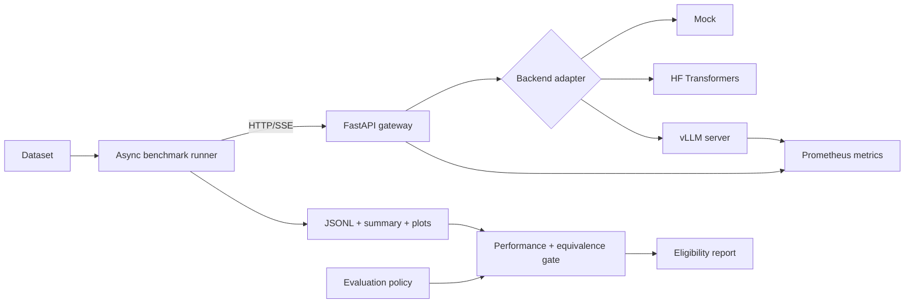

# Inference Lab

Inference Lab is a reproducible evaluation platform for comparing LLM inference backends under
controlled concurrent load.

**Release status:** the single-node benchmark workflow is validated end to end with deterministic
CI coverage and an audited [Qwen3-8B comparison on one A100](benchmarks/2026-08-01-qwen3-8b-a100/README.md).
The published run includes raw request records, aggregate summaries, environment captures,
checksums, and comparison plots.

The platform provides a stable streaming API, pluggable runtime adapters, Prometheus
instrumentation, an asynchronous load generator, auditable experiment artifacts, and a policy gate
that rejects faster backends when they violate performance or deterministic-equivalence
requirements. Its scope is inference serving and measurement; application-specific chat
interfaces remain outside the core system.

## Platform capabilities

- Backend-neutral synchronous and streaming inference contracts
- Deterministic mock, serialized Transformers, and OpenAI-compatible runtime adapters
- Controlled concurrent load with warm-up isolation and repeated trials
- Client-visible TTFT, end-to-end latency, request throughput, token throughput, and failure metrics
- Prometheus instrumentation for the gateway and vLLM runtime
- Containerized single-GPU vLLM deployment
- Reproducibility manifests covering source, dataset, model, runtime, and environment identity
- Performance-and-equivalence policies with CI-compatible pass/fail reports
- GPU-free CI for API, adapter, benchmark, and artifact-integrity paths

## Architecture



See [`docs/ARCHITECTURE.md`](docs/ARCHITECTURE.md) for component and design details.

## Tech stack

| Layer | Choice | Why |
|---|---|---|
| API | Python 3.11, FastAPI, Pydantic | Typed async API with automatic OpenAPI docs |
| Streaming | Server-sent events | Simple client-observable TTFT measurement |
| Baseline runtime | Hugging Face Transformers + PyTorch | Transparent reference implementation |
| Optimized runtime | vLLM OpenAI-compatible server | Production-oriented continuous serving runtime |
| Load generation | asyncio + HTTPX | Controlled concurrency without another service |
| Qualification | Versioned policy gate | Fail-closed performance and deterministic equivalence checks |
| Metrics | Prometheus client + Prometheus | Histograms, counters, in-flight load, token counts |
| Artifacts | JSONL and JSON | Easy to inspect, version, and analyze |
| Packaging | `pyproject.toml`, Docker Compose | Reproducible local and GPU setup |
| Quality | pytest, Ruff, GitHub Actions | GPU-free validation through the mock backend |

## Repository layout

```text
src/inference_lab/
  app.py                       FastAPI gateway and SSE contract
  backends/
    base.py                    Backend interface
    mock.py                    Deterministic CI backend
    transformers_local.py      Simple local PyTorch baseline
    openai_compatible.py       vLLM adapter
  benchmark/
    runner.py                  Concurrent benchmark CLI
    dataset_tokens.py          Tokenizer-aware workload validation
    evaluation.py              Deterministic output-equivalence analysis
    gate.py                    Performance policy and eligibility reporting
    stats.py                   Percentiles and throughput summaries
scripts/plot_results.py        Result plotting
data/                          Versioned benchmark workloads and token reports
benchmarks/                    Audited result sets and integrity checksums
policies/                      Versioned evaluation requirements
docs/                          Architecture and experiment plan
tests/                         API and statistics tests
```

## Start in mock mode

The mock backend validates the full service and benchmark path without downloading a model.

```bash
python -m venv .venv
source .venv/bin/activate
pip install -e ".[dev]"
uvicorn inference_lab.app:app --reload
```

In another terminal:

```bash
python -m inference_lab.benchmark.runner \
  --url http://localhost:8000 \
  --dataset data/prompts.jsonl \
  --concurrency 1,4,8 \
  --requests 24 \
  --repetitions 1 \
  --warmup-requests 2 \
  --max-new-tokens 32 \
  --output results/mock.jsonl
```

This is a smoke test, not a publishable performance run. The reduced repetition and warm-up
counts keep local validation quick.

Outputs:

- `results/mock.jsonl`: one row per measured request; warm-ups are excluded
- `results/mock.summary.json`: experiment manifest, per-repetition summaries, and median metrics
  per concurrency level

API documentation is available at `http://localhost:8000/docs`; Prometheus metrics are at `http://localhost:8000/metrics/`.

## Run the Hugging Face baseline

Install the optional PyTorch/Transformers dependencies:

```bash
pip install -e ".[dev,hf]"
cp .env.example .env
```

Set:

```dotenv
INFERENCE_LAB_BACKEND=transformers
INFERENCE_LAB_MODEL=Qwen/Qwen3-0.6B
INFERENCE_LAB_MODEL_REVISION=<full-hugging-face-commit-sha>
INFERENCE_LAB_MODEL_DTYPE=bfloat16
INFERENCE_LAB_TRANSFORMERS_DEVICE=auto
```

Then start the gateway and run the same benchmark command. The baseline deliberately serializes
generation, so concurrent requests queue and that queueing time appears in client/server TTFT. This
keeps seeded sampling deterministic and gives optimized serving behavior a clear comparison point.

## Run vLLM on an NVIDIA GPU

Prerequisites:

- Docker and Docker Compose
- NVIDIA driver
- NVIDIA Container Toolkit
- enough GPU memory for the selected model

```bash
cp .env.example .env
INFERENCE_LAB_BACKEND=openai docker compose --profile gpu up --build
```

The gateway is exposed on port `8000`, vLLM on port `8001`, and Prometheus on port `9090`.
This base Compose file leaves prefix caching disabled so it can serve as the vLLM default
configuration in the reference comparison.

For a measured comparison, set `INFERENCE_LAB_MODEL_REVISION` to a full Hugging Face commit SHA
and `INFERENCE_LAB_MODEL_DTYPE` to the same explicit dtype for both backends. Compose passes both
values to vLLM, while the Transformers adapter passes the revision to the tokenizer and model.
The gateway health response and benchmark manifest report the configured values. The defaults
`main` and `auto` are convenient for smoke testing but are not publishable controls.

### Service acceptance checks

Treat the gateway as ready only after `/health` returns HTTP 200 and reports the expected backend,
model, revision, and dtype:

```bash
docker compose --profile gpu ps
curl --fail --silent --show-error http://localhost:8000/health |
  python -m json.tool
curl --fail --silent --show-error http://localhost:8000/metrics/ >/dev/null
```

The benchmark runner performs the health preflight again before sending warm-up or measured
traffic. Use `docker compose logs gateway vllm` for service diagnostics. Stop the local stack with:

```bash
docker compose --profile gpu down
```

Stopping the stack does not remove benchmark artifacts or the host Hugging Face cache. Keep model
credentials in environment variables and never place secrets in benchmark metadata or committed
environment captures.

## Validate a workload against the pinned tokenizer

Workload names describe token ranges, not character or whitespace counts. Validate each dataset
with the exact tokenizer revision used by both serving backends before collecting measurements:

```bash
inference-lab-inspect-dataset \
  --dataset data/short_chat.jsonl \
  --model Qwen/Qwen3-8B \
  --revision b968826d9c46dd6066d109eabc6255188de91218 \
  --min-tokens 128 \
  --max-tokens 256 \
  --output results/short-chat-token-report.json
```

The command records the dataset digest, tokenizer identity, every prompt token count, summary
statistics, and any out-of-range prompt indices. It exits nonzero when a prompt violates the
declared bounds. The committed `short_chat.qwen3-8b.tokens.json` report records the validated
132–158 token range for the pinned Qwen3-8B revision. A test ties that report to the dataset digest
so prompt edits cannot silently leave stale token-length evidence behind.

For the separate repeated-prefix condition, use the explicit override:

```bash
INFERENCE_LAB_BACKEND=openai docker compose \
  -f docker-compose.yml \
  -f docker-compose.prefix-cache.yml \
  --profile gpu up --build
```

Run the benchmark:

```bash
python -m inference_lab.benchmark.runner \
  --url http://localhost:8000 \
  --dataset data/prompts.jsonl \
  --concurrency 1,2,4,8,16,32 \
  --requests 120 \
  --repetitions 3 \
  --warmup-requests 10 \
  --max-new-tokens 64 \
  --metadata experiment-metadata.json \
  --output results/vllm.jsonl
```

For published results, replace floating `latest` image tags with an exact image tag or digest and record the GPU, driver, model revision, and command.

## Reproducible artifacts

The runner checks `/health` before load starts and records the resolved backend and model. Every
summary also includes:

- a unique experiment ID and UTC start/finish times
- the canonical benchmark command, original process arguments, and all resolved settings
- Git commit and dirty state
- dataset path, SHA-256 digest, and prompt count
- client platform, Python version, and relevant package versions
- optional user-supplied server metadata

Use `--metadata` for facts the benchmark client cannot discover from the gateway. Keep secrets out
of this file. A publishable metadata file should look like this, with every placeholder replaced by
an observed value:

```json
{
  "hardware": {
    "gpu_model": "<exact GPU model>",
    "gpu_count": 1,
    "cpu_model": "<exact CPU model>",
    "ram_gib": "<observed RAM>"
  },
  "software": {
    "gpu_driver": "<driver version>",
    "cuda": "<CUDA version>",
    "container_image": "vllm/vllm-openai@sha256:<digest>",
    "model_revision": "<Hugging Face commit SHA>"
  },
  "runtime": {
    "flags": ["--gpu-memory-utilization", "0.90"]
  },
  "environment": {
    "INFERENCE_LAB_BACKEND": "openai",
    "INFERENCE_LAB_MODEL": "<model ID>"
  }
}
```

Defaults follow the experiment plan: 10 warm-up requests before each concurrency/repetition pair,
three measured repetitions, and median aggregate metrics. Warm-ups never appear in raw results.
`runs` in the summary contains the medians used by the plotting script; `trials` retains every
per-repetition summary. Raw rows contain stable prompt indices and hashes so prompt order can be
audited against the dataset digest.

If an upstream backend omits exact token usage, token counts and output-token throughput remain
`null`; the lab does not estimate them from whitespace. An HTTP 200 stream is counted as successful
only after a terminal `done` event.

## Gate a backend on performance and equivalence

Inference Lab can require an optimized backend to satisfy both performance SLOs and deterministic
output-equivalence constraints before it is marked eligible under a benchmark policy. This is an
opt-in workflow: ordinary performance runs retain no generated output.

Collect the reference and candidate with identical model, revision, dataset, and generation
controls. Use `hash` evidence for exact comparison without retaining plaintext:

```bash
inference-lab-bench \
  --url http://localhost:8000 \
  --dataset data/short_chat.jsonl \
  --concurrency 1,8 \
  --requests 120 \
  --repetitions 3 \
  --warmup-requests 10 \
  --max-new-tokens 64 \
  --temperature 0 \
  --top-p 1 \
  --seed 42 \
  --output-evidence hash \
  --output results/reference.jsonl
```

Run the same command against the candidate backend with
`--output results/candidate.jsonl`, then evaluate the pair:

```bash
inference-lab-evaluate \
  --reference results/reference.jsonl \
  --reference-summary results/reference.summary.json \
  --candidate results/candidate.jsonl \
  --candidate-summary results/candidate.summary.json \
  --policy policies/deterministic-serving.example.json \
  --output results/candidate.evaluation.json
```

The evaluator returns nonzero when any required control, artifact-identity check, performance
threshold, reference-stability check, exact-match threshold, or candidate-stability threshold
fails. Add `--report-only` when collecting a failing report is expected and the command should
still exit successfully.

The example policy contains illustrative requirements, not observed results; replace its values
with workload-specific SLOs before using it as a release gate. `target_concurrency` selects the
aggregate candidate rows to evaluate. Missing metrics fail closed rather than being ignored.

Evidence modes:

- `none` (default) retains output length only and cannot support equivalence evaluation.
- `hash` retains a SHA-256 output digest and supports exact-match and stability checks.
- `text` retains plaintext plus its digest and additionally supports
  `min_matching_prefix_character_ratio` and first-divergence diagnostics.

Hash evidence avoids storing plaintext but is not anonymization. Treat prompts, hashes, raw output,
and reports according to the dataset's data-handling requirements. The deterministic gate requires
temperature zero; sampled-output distribution testing remains a separate roadmap item. The
published A100 comparison predates output evidence and supports performance claims only—it cannot
be retroactively used for an equivalence claim.

The next registered hardware run is the
[Qwen3-8B A100 qualification protocol](docs/QUALIFICATION_RUN.md). Its performance and equivalence
scopes are independent: C32 carries the deployment-load regression envelope, while output
equivalence is checked across concurrency 1–32. Thresholds are committed before measurement and
must not be changed after results are inspected.

## Plot one or more summaries

```bash
pip install -e ".[plots]"
python scripts/plot_results.py results/vllm.summary.json
```

To overlay a controlled backend comparison:

```bash
python scripts/plot_results.py \
  results/transformers.summary.json \
  results/vllm.summary.json \
  --label Transformers \
  --label vLLM
```

The script creates separate throughput, TTFT, and latency figures under `results/plots/`.

## API examples

Non-streaming:

```bash
curl -s http://localhost:8000/v1/generate \
  -H 'content-type: application/json' \
  -d '{
    "prompt": "Explain KV caching in two paragraphs.",
    "max_new_tokens": 64,
    "temperature": 0
  }'
```

Streaming:

```bash
curl -N http://localhost:8000/v1/generate/stream \
  -H 'content-type: application/json' \
  -d '{
    "prompt": "Explain continuous batching.",
    "max_new_tokens": 64,
    "temperature": 0
  }'
```

## Fair benchmark checklist

- use the same model revision and tokenizer
- keep prompt order and generation parameters fixed
- warm up each runtime before collecting results
- separate short-prefill, long-prefill, decode-heavy, and repeated-prefix workloads
- run each configuration multiple times
- retain raw request results
- report failures and outliers
- record hardware, image digest, Git commit, and runtime flags

The runner records client-visible facts automatically. Hardware, driver, exact model revision,
container digest, and runtime-only flags must be supplied through `--metadata` and verified by the
experimenter.

See [`docs/EXPERIMENT_PLAN.md`](docs/EXPERIMENT_PLAN.md) for the controlled study protocol and
evaluation roadmap.

## Engineering roadmap

1. Compare BF16/FP16, INT8, and INT4 for speed, memory, and quality.
2. Build repeated-prefix workloads and measure prefix-caching impact.
3. Add speculative decoding and record draft-token acceptance rates.
4. Profile with PyTorch Profiler or Nsight and implement one Triton kernel.
5. Compare single-GPU and tensor-parallel multi-GPU serving.
6. Extend the deterministic equivalence gate with task-specific correctness and sampled-output
   distribution evaluators.

## Deployment scope

Inference Lab is designed for controlled benchmarking on trusted single-node infrastructure. The
gateway is not an internet-facing multi-tenant control plane: deployments that cross a trust
boundary must add authentication, authorization, admission control, quotas, request limits, and
transport security at the platform edge. See [`docs/ARCHITECTURE.md`](docs/ARCHITECTURE.md) for the
component boundaries and prioritized operational work.
