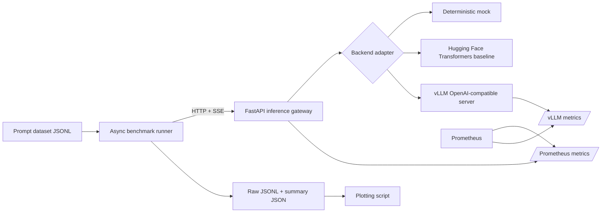

# Architecture

## Goal

Inference Lab isolates three concerns that are often mixed together in AI demos:

1. **Serving** — turn a model runtime into a stable streaming API.
2. **Measurement** — generate repeatable concurrent load and capture user-visible latency.
3. **Analysis** — compare backends using the same prompts, generation settings, hardware, and success criteria.

## System diagram

## Components

### FastAPI gateway

The gateway exposes one stable contract regardless of runtime:

- `GET /health`
- `GET /metrics/`
- `POST /v1/generate`
- `POST /v1/generate/stream`

The streaming endpoint uses server-sent events. It emits text chunks followed by a final event containing token counts, server-side time to first text, and total latency.

### Backend adapters

`InferenceBackend` defines `generate`, `stream`, `health`, and `close`.

- **MockBackend** makes CI and local benchmark validation deterministic.
- **TransformersBackend** is the intentionally simple, serialized single-process baseline.
- **OpenAICompatibleBackend** points at vLLM and keeps the gateway independent of vLLM internals.

This boundary makes future additions straightforward: TensorRT-LLM, llama.cpp, TGI, SGLang, Modal, or a custom runtime can be introduced without changing the benchmark client.

Every streaming adapter must end with a final `BackendChunk(finished=True, ...)`. The gateway turns
an adapter that ends early into an SSE error, and the benchmark requires a terminal gateway `done`
event before it records success. Token counts are optional at the interface because some upstream
servers do not return usage; unavailable counts remain unknown rather than being estimated.

The Transformers adapter holds a backend-local async lock for the full generation. This prevents
concurrent request threads from racing on the process-wide Torch random seed. Requests still enter
the gateway concurrently, and time spent waiting for the baseline lock is intentionally included in
TTFT and end-to-end latency. OpenAI-compatible runtimes retain their native scheduling behavior.

### Benchmark runner

The runner sends a fixed number of requests at each concurrency level and records:

- client-observed time to first text chunk
- end-to-end latency
- success/failure status
- prompt and output sizes
- request throughput
- output-token throughput
- P50 and P95 latency summaries

Raw request results are retained rather than only storing aggregates, which permits later statistical checks and graphs.
Per-trial wall time retains the full timer value used as the throughput denominator, allowing
serialized trial throughput to be recomputed without a hidden rounding discrepancy.

Before every measured concurrency/repetition pair, the runner sends a configurable warm-up batch
that is excluded from artifacts. Each request is linked to an experiment, repetition, concurrency,
request index, prompt index, and prompt hash. Per-repetition summaries are retained, while the
top-level `runs` view reports the median of each metric across repetitions.

The summary manifest records the dataset digest, generation/load settings, canonical command,
original process arguments, resolved gateway URL, Git revision and dirty state, client package
versions, UTC timestamps, and backend identity from the health endpoint. Server-side facts that the
gateway cannot safely infer—GPU, driver, image digest, and runtime flags—are accepted as explicit
JSON metadata. Model revision and dtype are configured through the shared settings, enforced by the
included Transformers and vLLM launch paths, exposed by health, and captured automatically.

### Observability

The gateway exposes Prometheus counters, gauges, and histograms for:

- request count and status
- in-flight requests
- end-to-end latency
- time to first token
- generated tokens

When vLLM is enabled, Prometheus can scrape both the gateway and runtime. This separates user-visible API behavior from engine-level behavior.

## Design decisions

### Why a gateway instead of benchmarking vLLM directly?

The gateway creates a backend-neutral API, permits identical instrumentation, and makes it possible to compare runtimes without rewriting the client. For serious vLLM-only performance work, also run vLLM's native benchmark and compare the findings.

### Why JSONL instead of a database?

For an MVP, append-friendly artifacts are easier to version, inspect, and reproduce. A database becomes worthwhile after adding experiment tracking, multi-user runs, or a dashboard.

### Why no React dashboard?

The hiring signal is inference measurement and systems depth. A dashboard would consume time while adding little evidence beyond the frontend experience already present on the resume.

## Production limitations

The MVP intentionally omits authentication, admission control, durable queues, multi-tenant quotas, distributed tracing, request cancellation propagation, and automatic model lifecycle management. These are valuable later milestones, not prerequisites for the first benchmarkable release.

## Prioritized remaining work

1. Run and document the first real-model comparison on pinned NVIDIA hardware. Real-model serving
   and the final comparison are unverified in this environment; one successful comparison would
   close both criteria and cannot be replaced by mock timings.
2. Add safe automated server telemetry capture for GPU memory/utilization and runtime-specific cache
   metrics. The current manifest accepts these as experimenter-supplied metadata.
3. Complete the remaining long-prefill, decode-heavy, repeated-prefix, and no-reuse datasets before
   drawing conclusions across workload types. The pinned Qwen3-8B short-chat dataset and tokenizer
   report now cover the first workload.
4. Pin runtime images and produce a dependency lock for published experiments.
5. Add a small correctness suite so performance comparisons also enforce output quality.
