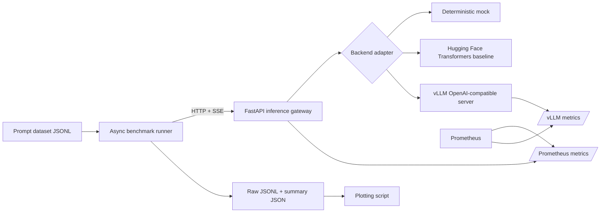

# Architecture

## Goal

Inference Lab isolates three concerns that are often mixed together in AI demos:

1. **Serving** — turn a model runtime into a stable streaming API.
2. **Measurement** — generate repeatable concurrent load and capture user-visible latency.
3. **Analysis** — compare backends using the same prompts, generation settings, hardware, and success criteria.

## System diagram

## Components

### FastAPI gateway

The gateway exposes one stable contract regardless of runtime:

- `GET /health`
- `GET /metrics`
- `POST /v1/generate`
- `POST /v1/generate/stream`

The streaming endpoint uses server-sent events. It emits text chunks followed by a final event containing token counts, server-side time to first text, and total latency.

### Backend adapters

`InferenceBackend` defines `generate`, `stream`, `health`, and `close`.

- **MockBackend** makes CI and local benchmark validation deterministic.
- **TransformersBackend** is the intentionally simple single-process baseline.
- **OpenAICompatibleBackend** points at vLLM and keeps the gateway independent of vLLM internals.

This boundary makes future additions straightforward: TensorRT-LLM, llama.cpp, TGI, SGLang, Modal, or a custom runtime can be introduced without changing the benchmark client.

### Benchmark runner

The runner sends a fixed number of requests at each concurrency level and records:

- client-observed time to first text chunk
- end-to-end latency
- success/failure status
- prompt and output sizes
- request throughput
- output-token throughput
- P50 and P95 latency summaries

Raw request results are retained rather than only storing aggregates, which permits later statistical checks and graphs.

### Observability

The gateway exposes Prometheus counters, gauges, and histograms for:

- request count and status
- in-flight requests
- end-to-end latency
- time to first token
- generated tokens

When vLLM is enabled, Prometheus can scrape both the gateway and runtime. This separates user-visible API behavior from engine-level behavior.

## Design decisions

### Why a gateway instead of benchmarking vLLM directly?

The gateway creates a backend-neutral API, permits identical instrumentation, and makes it possible to compare runtimes without rewriting the client. For serious vLLM-only performance work, also run vLLM's native benchmark and compare the findings.

### Why JSONL instead of a database?

For an MVP, append-friendly artifacts are easier to version, inspect, and reproduce. A database becomes worthwhile after adding experiment tracking, multi-user runs, or a dashboard.

### Why no React dashboard?

The hiring signal is inference measurement and systems depth. A dashboard would consume time while adding little evidence beyond the frontend experience already present on the resume.

## Production limitations

The MVP intentionally omits authentication, admission control, durable queues, multi-tenant quotas, distributed tracing, request cancellation propagation, and automatic model lifecycle management. These are valuable later milestones, not prerequisites for the first benchmarkable release.
