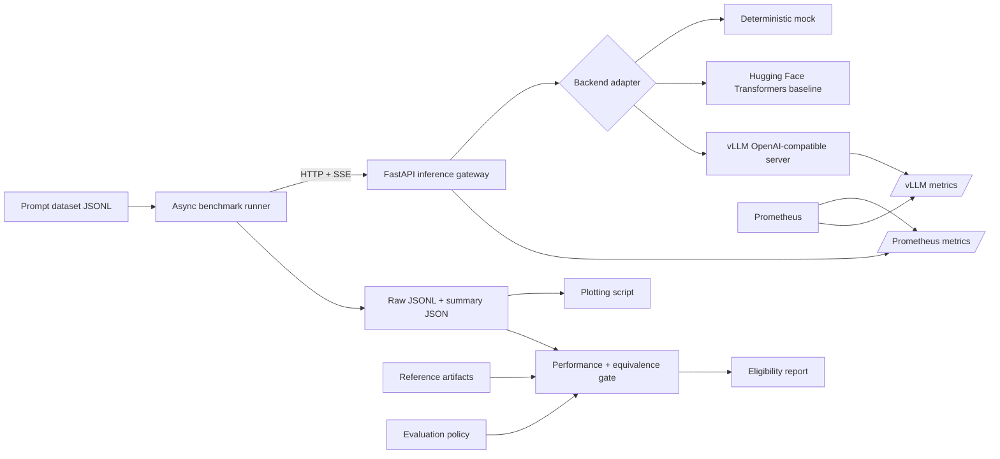

# Architecture

## Goal

Inference Lab isolates three concerns that are often coupled in inference systems:

1. **Serving** — turn a model runtime into a stable streaming API.
2. **Measurement** — generate repeatable concurrent load and capture user-visible latency.
3. **Analysis** — compare backends using the same prompts, generation settings, hardware, and success criteria.

## System diagram

## Components

### FastAPI gateway

The gateway exposes one stable contract regardless of runtime:

- `GET /health`
- `GET /metrics/`
- `POST /v1/generate`
- `POST /v1/generate/stream`

The streaming endpoint uses server-sent events. It emits text chunks followed by a final event containing token counts, server-side time to first text, and total latency.

### Backend adapters

`InferenceBackend` defines `generate`, `stream`, `health`, and `close`.

- **MockBackend** makes CI and local benchmark validation deterministic.
- **TransformersBackend** is the intentionally simple, serialized single-process baseline.
- **OpenAICompatibleBackend** points at vLLM and keeps the gateway independent of vLLM internals.

This boundary makes future additions straightforward: TensorRT-LLM, llama.cpp, TGI, SGLang, Modal, or a custom runtime can be introduced without changing the benchmark client.

Every streaming adapter must end with a final `BackendChunk(finished=True, ...)`. The gateway turns
an adapter that ends early into an SSE error, and the benchmark requires a terminal gateway `done`
event before it records success. Token counts are optional at the interface because some upstream
servers do not return usage; unavailable counts remain unknown rather than being estimated.

The Transformers adapter holds a backend-local async lock for the full generation. This prevents
concurrent request threads from racing on the process-wide Torch random seed. Requests still enter
the gateway concurrently, and time spent waiting for the baseline lock is intentionally included in
TTFT and end-to-end latency. OpenAI-compatible runtimes retain their native scheduling behavior.

### Benchmark runner

The runner sends a fixed number of requests at each concurrency level and records:

- client-observed time to first text chunk
- end-to-end latency
- success/failure status
- prompt and output sizes
- request throughput
- output-token throughput
- P50 and P95 latency summaries

Raw request results are retained rather than only storing aggregates, which permits later statistical checks and graphs.
Per-trial wall time retains the full timer value used as the throughput denominator, allowing
serialized trial throughput to be recomputed without a hidden rounding discrepancy.

Before every measured concurrency/repetition pair, the runner sends a configurable warm-up batch
that is excluded from artifacts. Each request is linked to an experiment, repetition, concurrency,
request index, prompt index, and prompt hash. Per-repetition summaries are retained, while the
top-level `runs` view reports the median of each metric across repetitions.

The summary manifest records the dataset digest, generation/load settings, canonical command,
original process arguments, resolved gateway URL, Git revision and dirty state, client package
versions, UTC timestamps, and backend identity from the health endpoint. Server-side facts that the
gateway cannot safely infer—GPU, driver, image digest, and runtime flags—are accepted as explicit
JSON metadata. Model revision and dtype are configured through the shared settings, enforced by the
included Transformers and vLLM launch paths, exposed by health, and captured automatically.

### Observability

The gateway exposes Prometheus counters, gauges, and histograms for:

- request count and status
- in-flight requests
- end-to-end latency
- time to first token
- generated tokens

When vLLM is enabled, Prometheus can scrape both the gateway and runtime. This separates user-visible API behavior from engine-level behavior.

### Performance and equivalence gate

The evaluation gate consumes reference and candidate raw results, their summaries, and a versioned
policy. It does not call either backend, so the decision can be reproduced from retained artifacts.
The gate verifies the following layers before reporting eligibility:

1. The model ID, full model revision, dataset digest, output limit, temperature, top-p, and seed
   match between reference and candidate manifests.
2. Raw rows belong to the experiment IDs declared by their corresponding summaries.
3. Candidate aggregate metrics satisfy every configured performance threshold at every target
   concurrency level.
4. Reference output is stable for every prompt, candidate output matches the stable reference at
   the required rate, and candidate output remains stable across the evaluated concurrency levels
   and repetitions.

Output evidence is opt-in at collection time. `hash` mode records SHA-256 digests for exact
comparison without placing plaintext in the result rows. `text` mode additionally enables a
character-prefix ratio and first-divergent-character diagnostics; mismatch reports contain hashes,
lengths, and offsets rather than copying output text. An inconsistent plaintext/digest pair is an
artifact integrity error.

The first gate supports deterministic decoding only. It requires temperature zero and fails closed
on missing controls, metrics, evidence, or unstable reference output. Model dtype is recorded but
is deliberately not an equality control so quantized candidates can be evaluated against a BF16
reference. Extending the gate to sampled decoding requires distributional tests rather than exact
per-request matching.

## Design decisions

### Why a gateway instead of benchmarking vLLM directly?

The gateway creates a backend-neutral API, permits identical instrumentation, and makes it possible to compare runtimes without rewriting the client. For serious vLLM-only performance work, also run vLLM's native benchmark and compare the findings.

### Why JSONL instead of a database?

JSONL is the canonical result format because it is append-friendly, portable, diffable, and easy
to audit independently of the service. Summary JSON files retain experiment-level metadata and
aggregates without hiding the underlying request records. A database can index these artifacts
when centralized experiment tracking or multi-user access becomes necessary; it does not replace
them as the reproducibility record.

### Why no integrated web dashboard?

Collection and analysis are deliberately decoupled from presentation. The command-line runner and
portable artifacts work in headless GPU environments and CI, while the plotting command produces
reviewable figures from one or more summaries. A dashboard can consume the same artifacts later
without becoming part of the measurement path.

## Operational boundaries

The current deployment profile targets controlled single-node experiments inside a trusted
environment. The gateway/runtime boundary is suitable for repeatable evaluation, but the gateway
must not be exposed as a public multi-tenant service without authentication, admission control,
quotas, request-size limits, transport security, and an explicit model lifecycle policy. Durable
queues, distributed tracing, and end-to-end cancellation propagation remain platform integration
work rather than properties of the benchmark protocol.

## Prioritized engineering work

1. Add safe automated server telemetry capture for GPU memory/utilization and runtime-specific cache
   metrics. The current manifest accepts these as experimenter-supplied metadata.
2. Complete the remaining long-prefill, decode-heavy, repeated-prefix, and no-reuse datasets before
   drawing conclusions across workload types. The pinned Qwen3-8B short-chat dataset and tokenizer
   report now cover the first workload.
3. Add a small correctness suite so performance comparisons also enforce output quality.
4. Add task-specific evaluators and sampled-output distribution tests to complement the existing
   deterministic equivalence gate.
5. Convert the recorded dependency freezes into build-enforced locks for future experiments. The
   first comparison pins the vLLM image and retains exact freezes, but the gateway build did not
   consume a lock during image construction.
